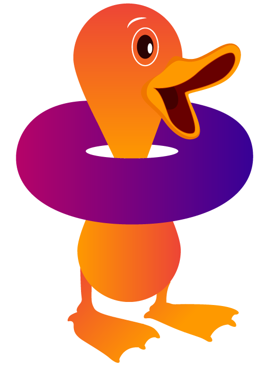

<link rel="stylesheet" type="text/css" href="../new-styles.css">

 

# Software

## Group-Developed Software

  
  <h3>FreeBird.jl</h3>
  
FreeBird.jl is a Julia package for statistical thermodynamic modeling of defects in materials. It supports lattice and atomistic models and implements direct quadrature, Metropolis Monte Carlo, replica exchange, Wang–Landau sampling, and nested sampling.

  

    <a href="https://wexlergroup.github.io/FreeBird.jl/">Documentation</a>
    <a href="https://github.com/wexlergroup/FreeBird.jl">GitHub Repository</a>
  

## Contributions to Other Software Projects

  <h3>pymatnest</h3>
  
pymatnest is a library for nested-sampling calculations on clusters and bulk materials. It calculates thermodynamic variables across temperatures, locates phase transitions, and determines phase diagrams. Calculations can use LAMMPS or the supplied Fortran models and either Monte Carlo or molecular dynamics sampling.

  

    <a href="https://libatoms.github.io/pymatnest/">Documentation</a>
    <a href="https://github.com/libAtoms/pymatnest">GitHub Repository</a>
  

  
  <h3>quacc</h3>
  
quacc is a software package for high-throughput computational materials science and quantum chemistry. The Rosen Research Group at Princeton University maintains the package.

  

    <a href="https://quantum-accelerators.github.io/quacc/">Documentation</a>
    <a href="https://github.com/Quantum-Accelerators/quacc">GitHub Repository</a>
  

