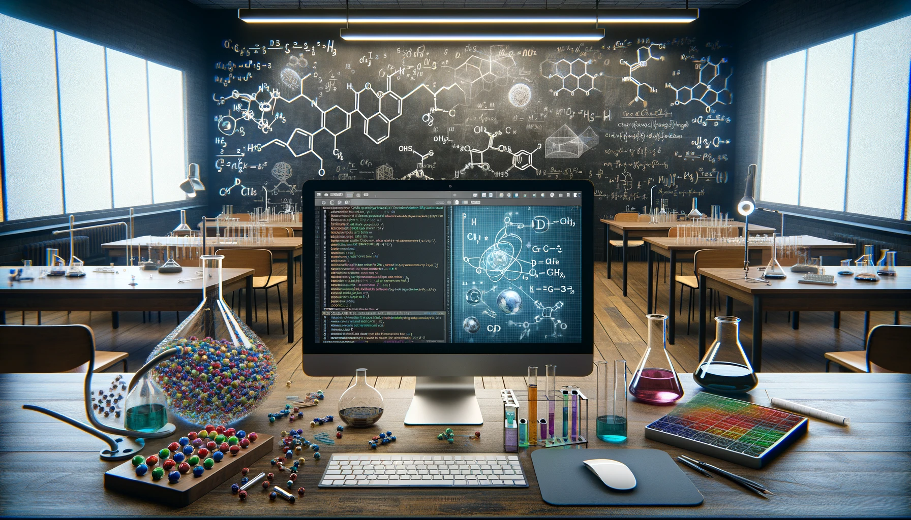
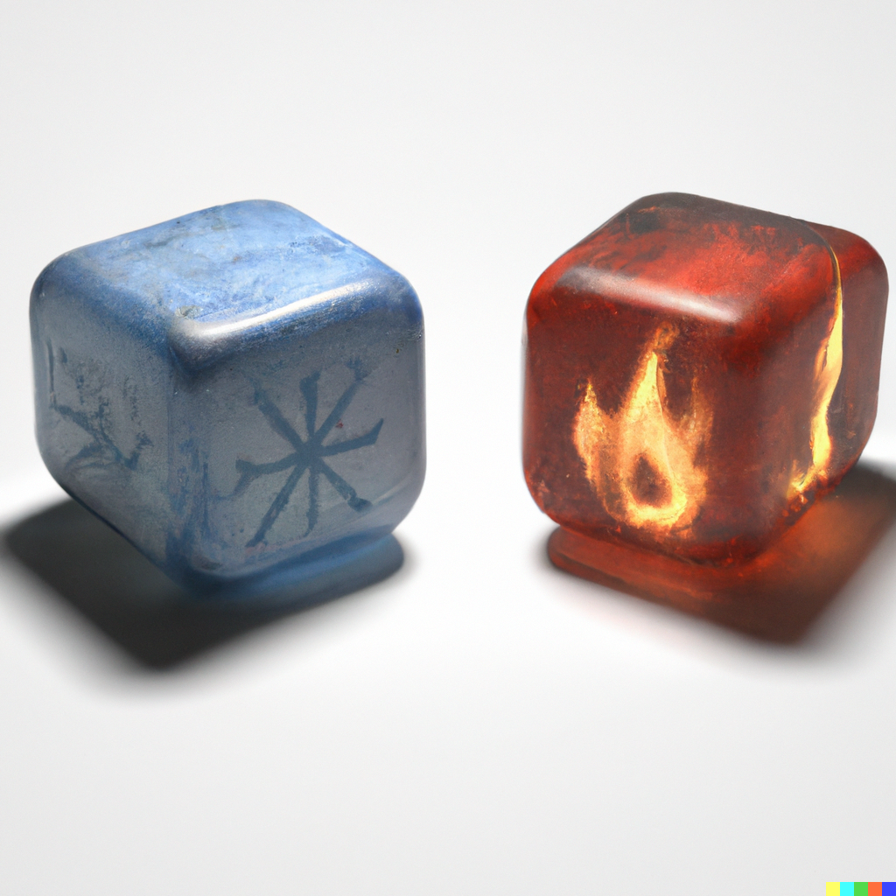

 

# Teaching

1. [Chem 4050/5050: Computational Problem Solving in the Chemical Sciences](#chem-40505050-computational-problem-solving-in-the-chemical-sciences)
2. [Chem 4020/5020: Physical Chemistry II](#chem-40205020-physical-chemistry-ii)

## Chem 4050/5050: Computational Problem Solving in the Chemical Sciences

[Website](https://rwexler.github.io/comp-prob-solv/intro.html){: .btn .btn--inverse}
[Syllabus](../assets/comp-prob-solv/syllabus.pdf){: .btn .btn--inverse}

Have you ever wondered how molecular interactions shape the world around us? Why do certain materials exhibit unique properties? How can we predict and manipulate chemical reactions at the atomic level? These are the mysteries at the heart of chemistry, where understanding the unseen world of atoms and molecules can unlock groundbreaking advances in science and technology. However, one needs specialized numerical methods and computational chemistry skills to explore these questions. This course is designed to bridge this gap. It provides a comprehensive introduction to the mathematical and computational skills necessary to model chemical phenomena at the atomic level. We start by building a strong foundation in mathematical representations of chemical problems, utilizing open-source software tools for problem-solving, data interpretation, and visualization of materials and molecular structures. In the second part of the course, we delve into the fascinating world of atomic-level computer modeling. You'll learn various methodologies, such as Monte Carlo and molecular dynamics. We'll analyze static (thermodynamic and structural) and dynamic properties and their statistical errors. Don't worry if you're new to coding - we'll cover the basics of Python programming in the first few lectures, setting you up for success. By the end of this course, you will be proficient in using computational tools, understanding atomic interactions, and approaching chemical problems with a structured and strategic thought process. Join us to unlock the secrets of the molecular world and transform the way you see chemistry!
{: .text-justify}

{: .align-center}

**Semester**: Fall 2024

## Chem 4020/5020: Physical Chemistry II

[Website](https://rwexler.github.io/chem-402-5020/intro.html){: .btn .btn--inverse}
[Syllabus](../assets/chem-402-5020/syllabus.pdf){: .btn .btn--inverse}

Intro to the properties and kinetic theory of gases, chemical thermodynamics, and statistical mechanics.
{: .text-justify}

{: .align-center}

**Semester**: Spring 2023, Spring 2024, Spring 2025
