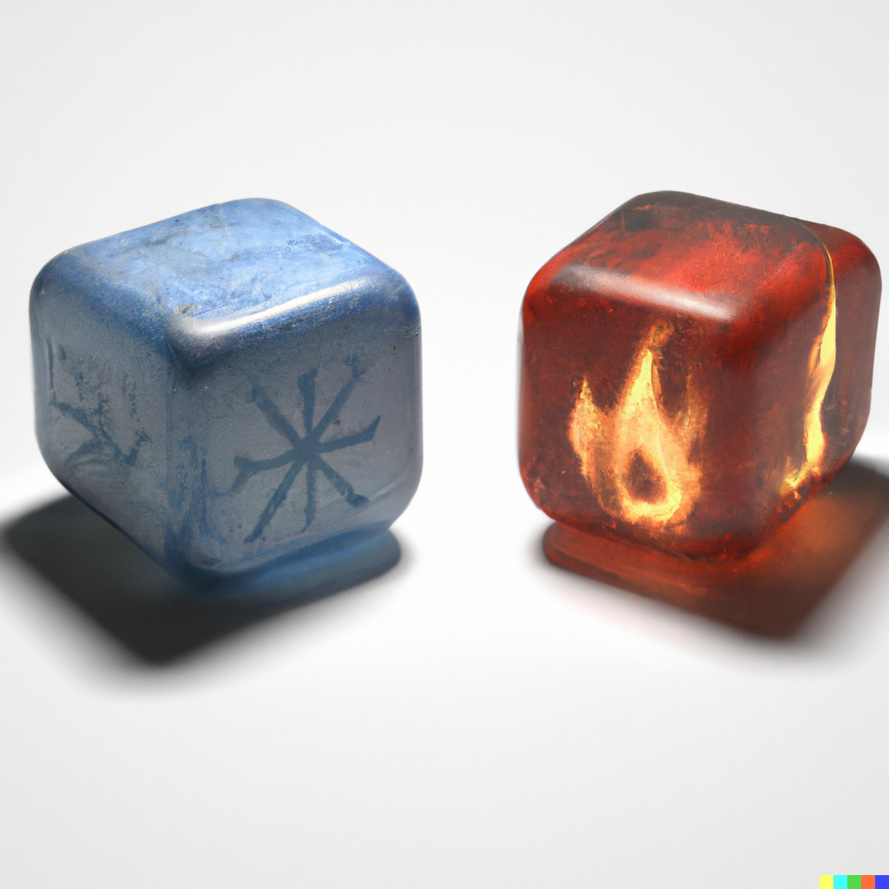

<h1 id="teaching" class="directory-page-title">Teaching</h1>

<nav class="teaching-nav" aria-label="Courses">
  <a href="#chem-40505050-computational-problem-solving-in-the-chemical-sciences">CHEM 4050/5050</a>
  <a href="#chem-40205020-physical-chemistry-ii">CHEM 4020/5020</a>
</nav>

<section class="teaching-course" aria-labelledby="chem-40505050-computational-problem-solving-in-the-chemical-sciences" markdown="1">

## CHEM 4050/5050: Computational Problem Solving in the Chemical Sciences
{: #chem-40505050-computational-problem-solving-in-the-chemical-sciences}

  

    
This course introduces mathematical and computational methods for modeling chemical phenomena at the atomic scale. Topics include mathematical representations of chemical problems, open-source tools for data analysis and visualization, Monte Carlo simulation, molecular dynamics, and analysis of statistical errors. The first lectures introduce Python, so no prior programming experience is required. Students learn to apply these methods to thermodynamic, structural, and dynamic properties.

    
<strong>Semesters:</strong> Fall 2024 and Fall 2025

    

      <a href="https://wexlergroup.github.io/comp-prob-solv/" aria-label="CHEM 4050/5050 course website">Course Website</a>
      <a href="../assets/comp-prob-solv/syllabus.pdf" aria-label="CHEM 4050/5050 syllabus PDF">Syllabus (PDF)</a>
    

  

  

</section>

<section class="teaching-course" aria-labelledby="chem-40205020-physical-chemistry-ii" markdown="1">

## CHEM 4020/5020: Physical Chemistry II
{: #chem-40205020-physical-chemistry-ii}

  

    
CHEM 4020/5020 covers the properties and kinetic theory of gases, chemical thermodynamics, and statistical mechanics.

    
<strong>Semesters:</strong> Spring 2023, Spring 2024, and Spring 2025

    

      <a href="https://wexlergroup.github.io/chem-4020-5020/" aria-label="CHEM 4020/5020 course website">Course Website</a>
      <a href="../assets/chem-402-5020/syllabus.pdf" aria-label="CHEM 4020/5020 syllabus PDF">Syllabus (PDF)</a>
    

  

  

</section>

